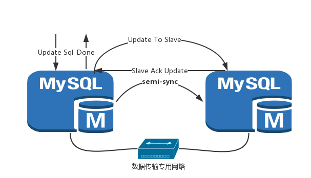
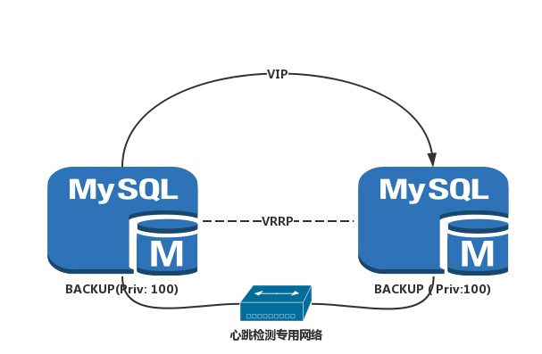
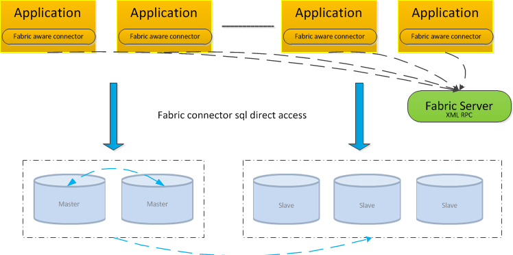
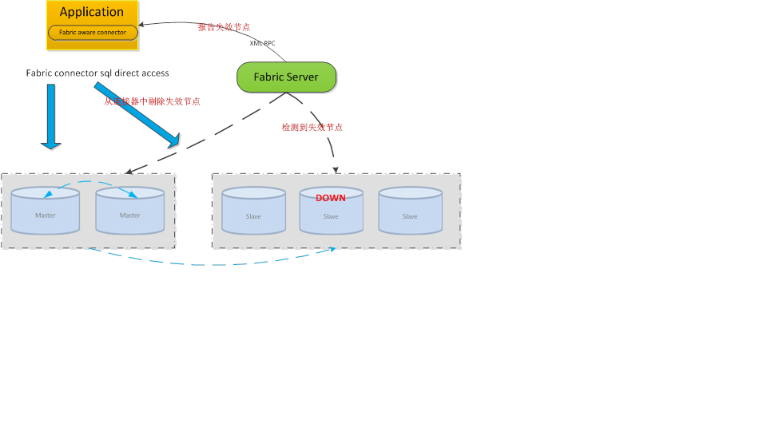
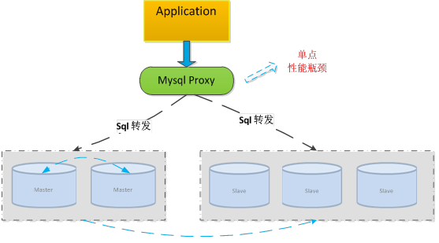

# 数据库服务 #

#RDS-高可用#

数据库高可用性通常是指在一个机房或者多个机房之间实现的高可用方案，通常都是通过冗余来实现的，比如，对于运行数据库的物理机器，通常其电源、网卡、磁盘、光纤通道等部件都是在不同的故障域中，同时会有两台或者多台机器同时运行数据库（或者一台运行一台备份），以防止某个硬件或者某台机器的故障。

RDS本质上也是一种数据库，当前数据库高可用方案繁多，各有利弊，
高可用方案从用户的角度来出发，综合成本，性能及可靠性，取长补短，
从网络架构、错误检测机制、数库一致性等多个维度综合考虑，基于openstack封装，实现业务的全自动交付。

## 数据同步机制 ##

 
Mysql数据同步机制

Mysql全版本默认采用InnoDB存储引擎，事务自动提交、崩溃回滚自修复的事务安全型表，同时禁用MyISAM表引擎，避免数据的一致性及备份写阻塞。兼容发布已久的稳定可靠版本Mysql5.5，以及提升了高负载下数据处理能力，支持GTID主实例，并且修复主从实例crush导致的不一致性等重大问题的Mysql5.6。

重要的，利用5.6 semi sync replication机制，确保在发生切换时，数据零损失。另外，为了确保数据复制时的低延时，底层使用专用的数据复制网络来做数据传输，避免与心跳网络、用户数据网络相互影响。

   
## 故障检测机制 ##
 

Mysql故障检测机制

## 独立心跳网络 ##

两个节点可以采用双主热备模式，并且放置于同一个VLAN中，在master节点发生故障后，利用keepalived的高可用机制实现快速切换到别一个master节点，并且保证对外IP不变。

## HA节点模式 ##

VRRP双方节点都启动以后，要实现状态转换的，刚开始启动的时候，初始状态都是BACKUP，而后向其它节点发送通告，以及自己的优先级信息，谁的优先级高，就转换为MASTER，否则就还是BACKUP，这时候服务就在状态为MASTER的节点上启动，为用户提供服务，如果，该节点挂掉了，则转换为BACKUP，优先级降低，另一个节点转换为MASTER，优先级上升，服务就在此节点启动，VIP,VMAC都会被转移到这个节点上，为用户提供服务。

特别的，本设计采用双BACKUP的机制以及相同优先级的方案避免了优先级
竞争导致的频繁切换。

 
## 高可用下备份 ##

     
RDS为用户提供快照技术，创建快速方便，不影响其他操作的进行。用户可以为实例创建多份快照，并可随时通过快照恢复实例数据。RDS支持手动创建快照和自动创建快照，可以设置自动快照的创建时间和创建周期。为用户的数据提供更加全面的保障。

-秒级增量备份 – 快速完成数据备份，避免大数据量备份时间过长。

-避免链式依赖 – 不同于市场上某些云数据库产品，备份点之间存在强依赖，无法单独删除，RDS采用了不同的方式，可单独删除某增量备份快照。

-线上业务无干扰  – 基于快照的备份过程不占用实例IO资源、无业务阻塞。

## 对比分析 ##
关于MySQL-HA，目前有多种解决方案，比如drbd、mmm、共享存储，但是它们各有优缺点。

MMM: MMM(Master-Master replication managerfor Mysql，Mysql主主复制管理器)是一套灵活的脚本程序，基于perl实现，用来对mysql replication进行监控和故障迁移，并能管理mysql Master-Master复制的配置(同一时间只有一个节点是可写的), 但设计复杂，并需要额外的机器来部署，切换速度相对Keepavlied来说差不少。

DRBD：DRBD实际上是一种块设备的实现,主要被用于Linux平台下的高可用(HA)方案之中。他是有内核模块和相关程序而组成，通过网络通信来同步镜像整个设备。同样的，DRBD只是同步了数据，Mysql在另一端需要关闭的状态，发生故障时需要启动Mysql，因此很少做到秒级切换。

共享存储：类似DRBD，但如果发生脑裂，数据格式有可能损坏，造成无法承受的后果。

# RDS-分布式读写分离  #

随着业务不断扩展，数据不断增加，数据库的压力也会越来越大，对数据库或者SQL的基本优化可能达不到最终的效果，我们可以采用读写分离的策略来改变现状。
 
读写分离简单的说是把对数据库读和写的操作分开对应不同的数据库服务器，这样能有效地减轻数据库压力，也能减轻io压力。主数据库提供写操作，从数据库提供读操作，其实在很多系统中，主要是读的操作。当主数据库进行写操作时，数据要同步到从的数据库，这样才能有效保证数据库完整性。mysql有自己的同步数据技术。mysql只要是通过二进制日志来复制数据。通过日志在从数据库重复主数据库的操作达到复制数据目的。这个复制比较好的就是通过异步方法，把数据同步到从数据库。
 
主数据库同步到从数据库后，从数据库一般由多台数据库组成这样才能达到减轻压力的目的。读写分离架构设计就是解决读写分离的性能与可靠性问题。

Mysql  Fabric 故障检测机制

## 无性能瓶颈 ##

应用程序使用mysql连接器访问数据库，从特定程序语言转换指令到Mysql ware protocol，与mysql服务器进程进行通信。Fabric-aware连接器存储从mysql fabric取来的路由信息缓存，使用这些信息发送事务或查询到正确的mysql服务器。当前支持Fabric-aware mysql连接器的有PHP、python和Java。

类似于当于分布式系统主流设计，客户端将直接连到后端数据库实例，分布式组件的引入仅是拓扑的变化，变将拓扑信息反馈到客户端连器，实际的读写流量并不会经过任何中间件，该方法避免了发送所有查询到proxy引起的瓶颈。

## 故障切换 ##

          
Mysql  Fabric 故障切换机制

Fabric实时监控数据库实例状‘态，一旦有实例状态异常，就会将失效节点的信息推送给fabric aware connector, fabric aware connector是对用户透明的一个连接器，拓扑的变化不会影响用户代码的编写，失效节点能够无缝地从连接池中删除。一旦失效节点恢复正常，fabric server同样会再次把相关信息推送给fabric aware connector，并无缝加入到连接池中来。

## Connector 支持列表 ##

Connector/J 5.1 (GA)	5.1	

Connector/J 6.0 

Connector/ODBC

Connector/Net

Connector/Node.js

Connector/Python

Connector/C

Connector/C++

## 对比 ##

当前做Mysql的读写分离主要是三个方案：Mysql Proxy 、Mysql router和 Mysql Fabric

MySQL Proxy是一个处于你的client端和MySQL server端之间的简单程序，所有的读写请求都需要先经过proxy节点，再从proxy节点转发到后端数据库实例。
显然，Mysql Proxy将成为新的单点以及性能瓶颈。
Mysql Router的问题和Proxy类似，都是这种代理的模式。

 
 Mysql  Proxy  架构示意

区别于之前proxy的架构，分布式主从架构完全对用户透明，没有单点故障，并且解决了proxy性能。

分布式主从架构完全舍弃了传统的proxy节点，引入fabirc节点来监控整个集群的工作状态，并把这些状态发送到客户端connector, connector完全能够感知到节点的状态和角色，sql语句通过connector直接发送到数据库节点，最大程度地发挥了集群的性能并且不存在单点故障及极强的横向扩展能力。

是否存在单点问题、性能瓶颈、扩展性、性能损耗

-Mysql Fabric	无	无	高	无

-Mysql Proxy	    有	有	低	高

-Mysql Router	有	有	低	高
