# 块存储 #

# CDP(连续数据保护) #

为了能够满足在灾难发生后以最快的速度恢复到距离故障点最近时刻的需求，连续数据保护（Continuous Data Protection，CDP）应运而生。CDP是一种连续捕获和保存数据变化、并将变化后的数据独立于初始数据进行保护的技术。从理论上讲，该技术可以实现过去任意一个时间点的数据恢复。图1为连续数据保护（CDP）技术的架构图。当CDP主机端发生写操作时，每一个写请求IO都将被捕获，然后保存在CDP仓库中。保存在CDP仓库中的每一个写请求称作CDP数据。为了数据恢复需求，针对每一个CDP数据，都需要有相应的元数据进行记录，称作CDP元数据。CDP元数据也被保存在CDP仓库中。根据每一个CDP数据和CDP元数据，我们可以将数据恢复到过去的任意一个时刻或者IO。
 
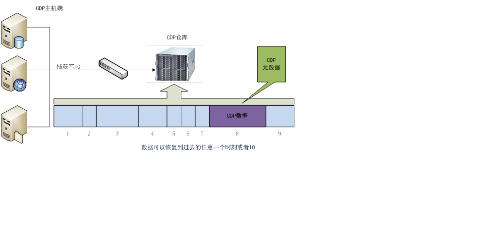

连续数据保护（CDP）技术架构图

将连续数据保护技术应用于我们的产品中，对云主机中的磁盘提供连续数据保护。当故障发生时，使得数据可以恢复至最近的时刻或者过去任意一个时间点。

## 开放的Restful API ##

我们提供了Restful API，方便用户进行二次开发。开放的API包括：

- 开启/关闭CDP服务

针对某一块云磁盘，用户可以灵活地为其开启或者关闭CDP服务。一旦开启该服务，云硬盘的所有写请求都将自动地被捕获和保存。

- 秒级恢复数据

当云硬盘发生故障时，管理员需要指定要恢复的时间点，则可以将磁盘数据恢复至指定的时间点。

- 历史数据删除

随着CDP服务开启的时间越来越长，捕获和保存的写请求将越来越多，不仅需要耗费大量的存储空间，同时历史越久的数据价值越小。因此，我们提供了基于策略的历史数据删除方式，用户可以选择根据配额限制或者定期地将历史数据删除，以减少存储开销。

## CDP技术 ##

CDP技术的实现框架图

主要有三个功能：

- 创建参考数据版本：创建快照，将磁盘创建开始至该快照之间的数据进行提取，并传输至CDP服务器端，作为参考数据版本。

- 写IO捕获和处理：开启虚拟机之后自动启动写IO捕获模块，截获的每一个写IO数据传输并备份CDP服务器端。备份存储的数据分为两种类型。其中实际的数据变化内容写入数据卷，本次IO的元数据信息写入元数据卷。

- 数据恢复：根据参考数据版本、数据卷和元数据卷，恢复出任意时间点（秒级）的数据。
 
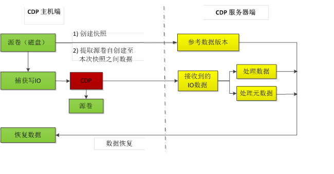

针对云主机磁盘的连续数据保护技术实现框架图

引入CDP技术，主要是通过在Qemu的block层中添加了一个CDP中间层。开启虚拟机之后，针对每个进来的写IO，该CDP中间层都会先判断本次IO所属的磁盘是否开启了CDP服务。如果没有开启，则仍然执行原来的IO流程；如果开启了，则将本次要发送到存储系统（比如ceph，nfs或者glusterfs等）的IO进行分流，除了写入原来的磁盘外，还会对本次IO进行处理，并将IO数据和处理结果以异步的方式传输备份到CDP仓库中，传输协议支持rbd，nfs，glusterfs等。图3为开启CDP服务前后QEMU中的IO路径：
       
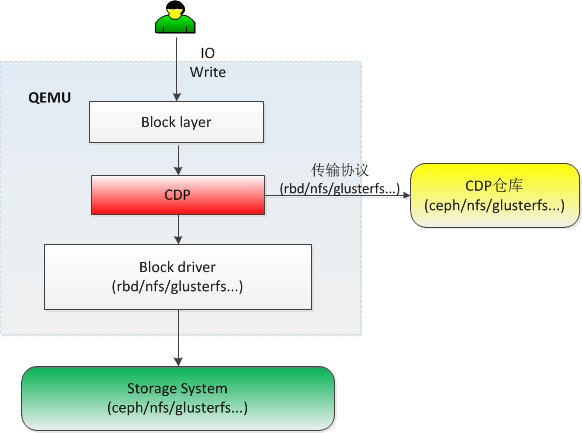

加入CDP后的IO路径

通过CDP技术，在灾难发生后，虚拟机的数据可以恢复到过去的任意一个时间点，极其有效地保护了用户的数据。下面为CDP技术的优势：

## CDP技术优势 ##

- 持续保护

一旦云硬盘的CDP服务开启后，就会自动捕获每个写IO并进行独立存放，真正实现持续保护。

- 秒级恢复

当云硬盘发生故障时，管理员指定希望恢复的时间点，然后通过调用恢复API，就可以将数据恢复至用户指定的时间点。

- 灵活删除

随着CDP服务开启的时间越来越长，捕获和保存的写请求将越来越多，不仅需要耗费大量的存储空间，同时历史越久的数据价值越小。因此，我们提供了基于策略的历史数据删除方式，可根据容量配额或者定时地将之前的历史数据删除。

- 轻量开销

我们采用了并发线程，异步IO等技术，已确保在不影响原有写IO的前提下，进行IO捕获和处理。

另外，存放在CDP服务器上的数据进行了压缩存储，节省存储开销可达60%之上。

## CDP产品对比 ##

目前，市面上的云存储及其产品， 仅有Ucloud公司的数据方舟提供了类似的数据保护服务。
对比...

# 异地快照 #

## 异地快照技术 ##

所谓“异地快照”，就是定期或者不定期地将本Region上的快照复制到异地Region。复制方式支持全量和增量两种。当本地数据中心发生故障时，可以在异地数据中心根据最近复制过去的快照进行数据和应用的恢复。通过该项技术，可以在很大程度上减少故障或灾难发生时刻数据丢失的概率，同时缩短数据恢复的时间。

异地快照适用场景

通过异地快照功能，我们可以适应更多的用户场景，比如：

- 异地灾难恢复

- 跨数据中心迁移应用数据

- 地理区域的扩展，在一个新的区域内推出自己的应用。

## 异地快照技术架构 ##
 
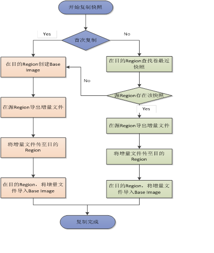

异地快照功能流程图

图1描述了异地快照功能的主要流程。在开始复制之前，首先要判断是否是第一次将指定云硬盘的快照复制到目的Region上。如果是则要进行全量复制，否则的话就要进一步判断是否要进行增量复制。下面，我们将通过一个例子，详细介绍RBD（以Ceph集群作为存储后端）异地快照功能的实现流程。假设源Region（北京），目的Region（上海）。北京区域目前有一个卷，该卷有若干个快照链，比如A-B-C-D-E， F-G-H。注意：每个快照链都有一个自己的base镜像！本次执行异地快照复制的目的是将快照D复制到Region上海。具体的实现流程如下：

0）在目的Region（上海）添加针对快照D的数据库记录（快照ID和源Region上的快照D相同），并将两地的快照D状态都这是为‘copying’；

1）	获取快照D所在的base image，假设为image1；

2）	判断image1是否存在于Region上海，若存在，转3）；否则先创建一个Base image，即image1，然后转6）；

3）	获得目的Region（上海）的image1的最新snapshot，假设为B，若存在转4），否则转6）；

4）	查看B是否存在于源Region（北京）的image1中，若存在转5；否则转6）；

5）	调用export-diff命令获取源Region（北京）的image1的增量数据（from-snap=B至快照D之间的增量数据），存于D’文件中（增量）。转7）

6）	调用export-diff命令获取源Region（北京）的image1的增量数据（从image1创建至快照D之间的增量数据），存于D’文件中（全量）。转7）

7）	将D1传输到目的地；

8）	调用rbd的import-diff命令将D’导入到image1中；

9）	若复制成功，更新目的Region（上海）数据库，状态设置为‘Available’；若复制失败，则更新目的Region（上海）数据库，状态设置为‘error’。

另外，我们需要考虑一种情况，就是不同数据中心的存储系统之间是禁止访问的。在这种情况下，在快照复制的过程中，我们需要一个中转站。目前可以通过cos（对象存储）或者swift进行中转（如图2所示）。假设快照原来存放在Region A，需要将其复制到Region B，那么这个中转站可以位于Region A或者Region B，也可以位于第三个Region C，前提是Region A和B都必须能够访问到它。总的一个过程就是，需要先把Region A上的快照文件通过增量或者全量的方式导出来（export），然后上传到中转站，最后从中转站上将文件下载到Region B，并进行处理保存。如下图所示：我们假设Region A（上海），Region B（北京），Region C（深圳），D’为导出的增量文件。
 
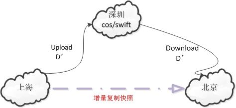

利用swift/cos中转站进行快照复制

## 异地快照技术优势 ##

- 灾难恢复：在不同的Region定期备份您的数据和日志。当灾难发生时，您可以在异地的数据中心恢复和启用您的数据和应用。这样做可以让数据丢失和恢复时间降到最低。

- 便于业务扩展：随着业务扩大的需求，可通过异地快照技术，快速将数据和应用复制到新的Region。

- 灵活选择：您可以在多个Region之间，出于可用性和成本等考虑，进行灵活选择。

## 类似技术/产品对比 ##

AWS提供了与异地快照相似的功能，即Copy Snapshot（“复制Amazon EBS快照”）。可以将快照从一个AWS区域复制到另外一个AWS区域或者复制到相同区域内。快照副本将获得与原始快照ID不同的快照ID。Amazon将本地快照和异地快照都存储在Amazon Simple Storage Service（Amazon S3）中。

由于AWS的快照副本存放在Amazon S3中，当本地机房发生故障需要从目的机房的快照副本恢复云硬盘数据时，就必须先从S3中下载快照副本。因此，将导致云硬盘恢复较慢。而的快照副本是存储在异地机房的本地存储中，当需要在异地机房恢复时，瞬间即可恢复。另外，本地快照和异地快照副本具有相同的ID，也便于用户的管理。

# SAN存储虚拟化 #

## 介绍 ##

在云平台管理系统中，可以创建多种类型的云硬盘，而LVM也是广泛使用的一种后端存储方式。它抽象了磁盘以及分区的概念，实现用户更加透明的去创建和管理存储。如下图所示为LVM的图示，通过将磁盘分区创建成PV，进而创建成VG。组成一个大容量的存储池，上层应用程序就可以在该存储池中创建指定大小的LV，进而将LV挂载给虚机使用。

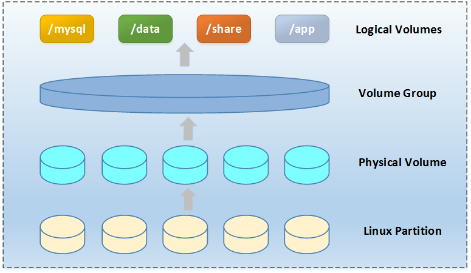 
LVM图示

目前，在云计算平台中通畅采用的是如下图所示的方案将LV挂载给虚机使用，图示中包括两个计算节点和一个存储管理节点。其中存储管理节点负责云硬盘（即LV卷）的创建与删除、初始化挂载连接、创建于删除快照等工作。通过iSCSI协议将LV卷暴露给计算节点，计算节点调用QEMU/KVM将卷挂载给虚机使用。
所述的传统方案通过LVM以及iSCSI方式实现，由于统一由存储管理节点来实现LV卷的初始化连接与释放，所有计算节点的虚机对云硬盘的读写操作都将通过存储管理节点。一定程度上加大了存储管理节点的压力。当云硬盘数量很大时很容易造成存储管理节点达到性能瓶颈。当前OpenStack系统的块存储Cinder服务默认采用的就是该种部署方式，用于开发环境中，不适合生产环境中使用。

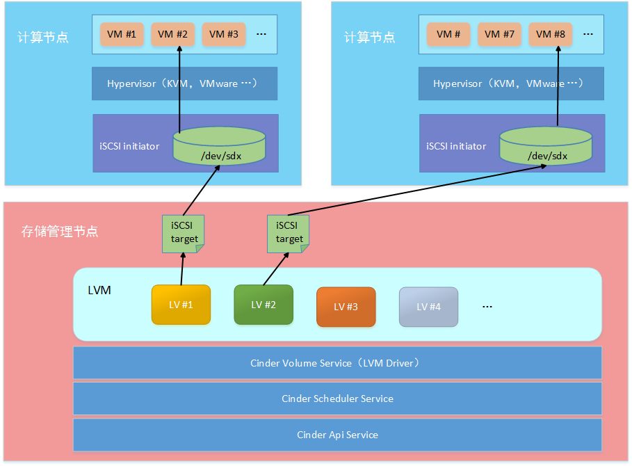 
传统方案图示

另外，各种商用的SAN存储厂商实现了针对自己的SAN设备的插件式的Driver，并将其集成到OpenStack的块存储服务Cinder中。对于那些没有对应Driver的SAN设备，则很难直接纳入到云平台系统的存储管理中。
基于以上两点背景问题，我们开发实现了一种SAN存储虚拟化的解决方案。该方案可以很好的解决上面两个问题。

## 实现机制 ##

SAN存储虚拟化方案的总体思想是通过将SAN存储设备同时挂载给存储管理节点和所有计算节点，实现一个共享的存储池，进而对该存储池进行PV以及VG的创建，将这个统一的VG提供给云平台使用。
云存储管理节点LV的管理工作，通过cLVM2以及Pacemaker集群实现存储管理节点以及所有的计算节点上的LVM元数据信息的通过工作。因为整个存储池是共享的，因此当挂载LV卷给虚机时候是直接在计算节点上完成的。而不是通过存储管理节点。
如下图所示为该方案架构图，其中为了实现存储管理节点和所有计算节点的LVM的元数据同步，采用了Pacemaker集群方式。

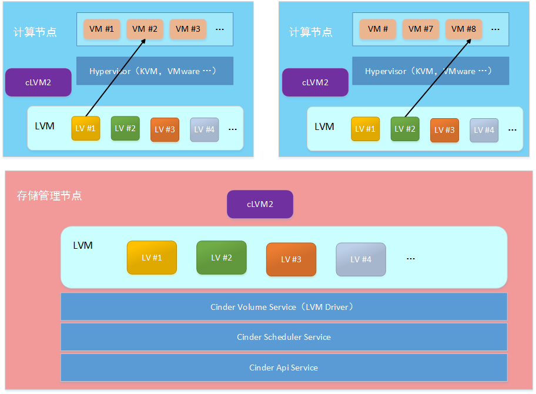  
SAN存储虚拟化图示

Pacemaker以及cLVM2构成的系统图示如下图所示。

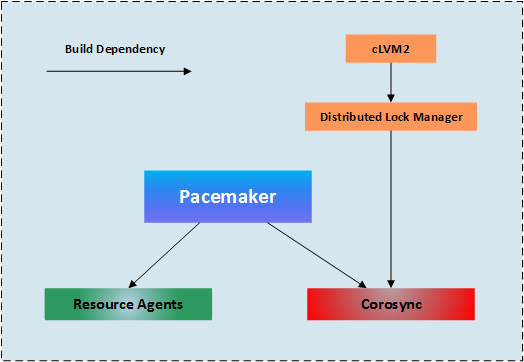   
Pacemaker图示
## 技术优势 ##

计算节点直接挂载LV卷给虚机，不通过存储管理节点，大幅提升了IO性能并解决了控制节点的单点的问题。

同时控制节点作为Openstack服务宿主机，跑存储IO流量也会影响到服务本身。

另外，通用的SAN驱动可以方便的管理各种SAN存储设备，将异构的SAN存储设备统一管理。降低了开发与运维成本。

# 异构存储热迁移 #

## 介绍 ##

企业数据中心会随着企业业务的不断扩大也同步扩大，需要跟多更强的存储和计算能力。如何在业务不中断的情况下将原有存储转移到新设备就是易购存储热迁移的任务。除了设备更新外，原有设备维护进而将存储内容转移到临时设备，等到设备维护完成再迁移回去也是异构存储热迁移的一个应用场景。

## 实现机制 ##

异构热迁移构架
 
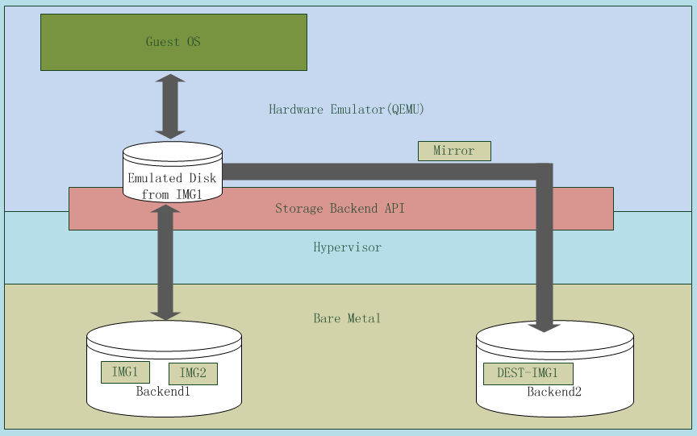
  
热迁移基于qemu/kvm框架，不同的存储后端需要连接到同一台物理主机，由于迁移是基于同一个虚拟机的。Guset OS的disk原来由Backend1的IMG1模拟。运行热迁移功能后disk的模拟文件被Backend2的DEST-IMG1替换。
虽然每个Backend会有各自的差异，但是QEMU在设备模拟层和Hypervior层做了一层抽象，使得磁盘迁移函数根本不会觉察底层是使用的不同的后端。

## 异构热迁移工作流 ##

异构存储热迁移由以下四个过程组成。

- 块迁移

这个过程中的块设备写入会被写到源磁盘中去，每个写入扇区都会通过dirty bitmap的一位做标记。此过程最主要的工作是将源上的所有数据从第一个扇区到最后一个扇区全部拷贝到目的盘，即Backend1.IMG1到Backend2.DEST-IMG1. 如下图中将所有蓝色块一一拷贝到灰色块中。
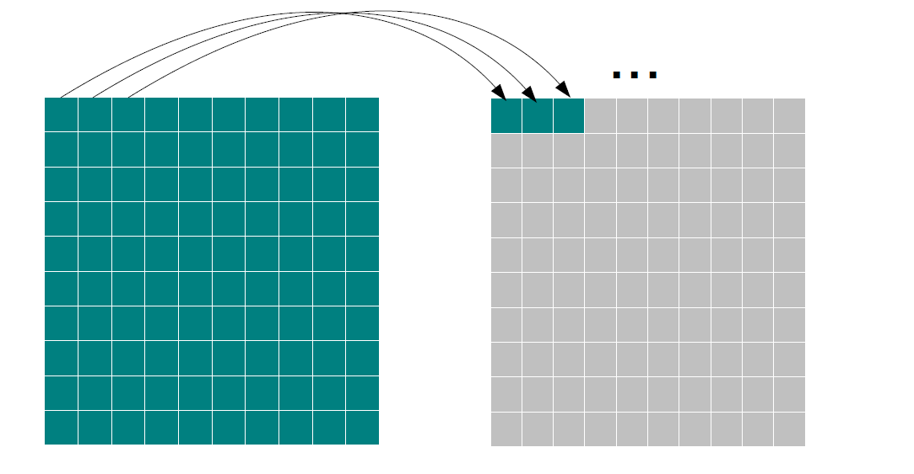  
位图数据拷贝

- 脏数据拷贝
这个过程主要是将上一个过程中的脏数据拷贝到目标盘，脏数据可以通过标记过的dirty map来获得。如下图中红色块表示脏数据。
 
脏数据拷贝

- 镜像写
上个过程结束后源端和目标端的数据已经一致了，接下来的所有写操作都会同时写道源端和目标端已保持数据的一致性。
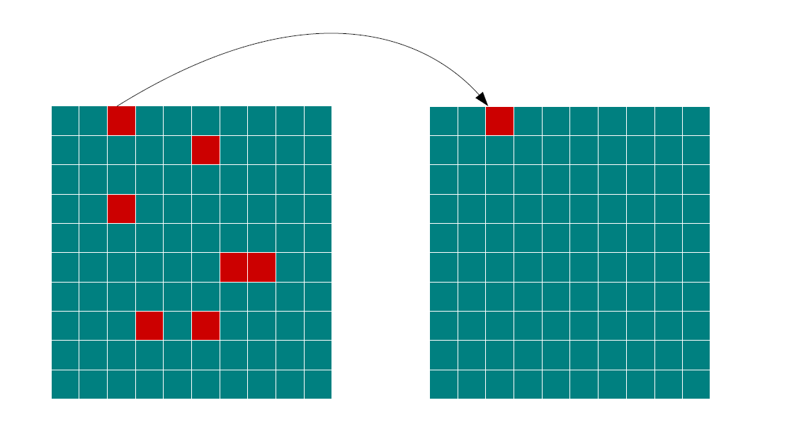   
镜像写操作

- 替换原盘
一旦开始替换原盘操作，新的写操作都会被存储在一个内存对列中。直到目标盘已经替换原盘，这些写操作会被执行。新的写操作也可以继续执行。

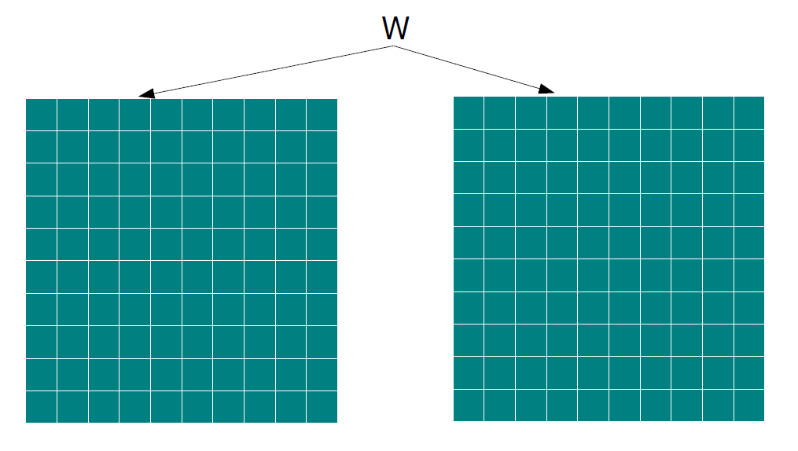  
## 技术优势 ##

支持qemu/kvm平台下不同后端间的存储迁移，后端类型包括qcow2，raw，rbd。用户业务无宕机。使用qcow2类型的热迁移可以有效减少数据迁移时产生的流量，因为实际没有数据的块不会占用物理空间，迁移时也就不需要移动这些块。

.....
