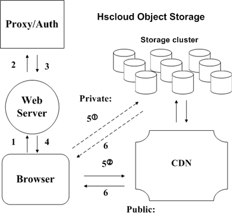
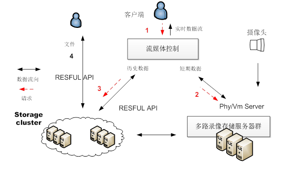
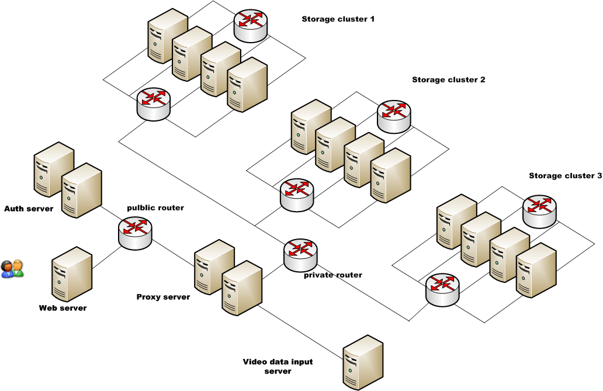
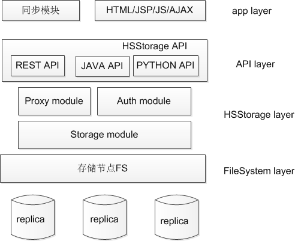
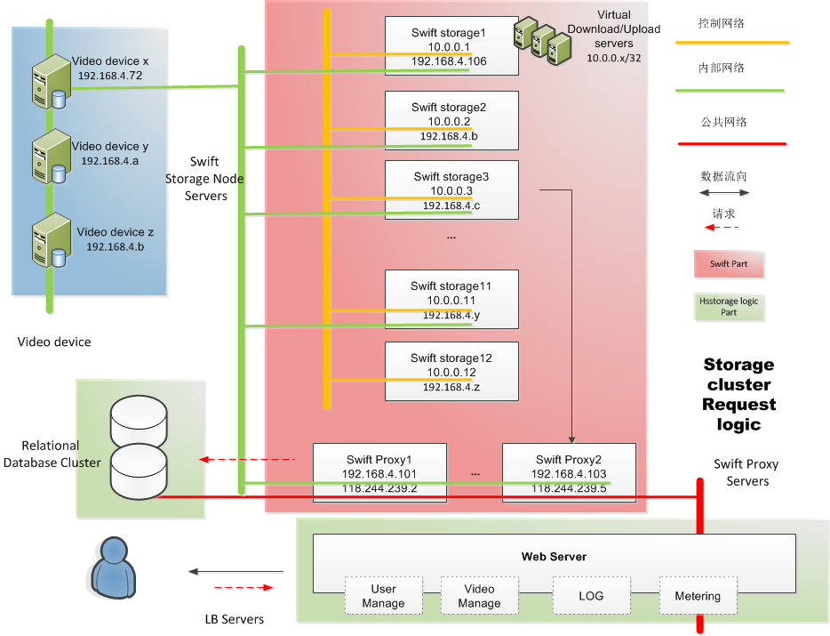

## 项目目标 ##

xxx计划建设并维护云存储机群，以便：

- 满足客户和自身海量数据(监控视频、数据库资料)存储的需求,存储数据量>=200T，灾备存储比（1:2）
- 减少基础设施、架构中的大量的、基本的、重复的劳动（更换磁盘、阵列设备，重构存储结构）
- 提高服务质量，做更多对于客人、对于品牌来说更有意义的事情
- 整合、复用有效资源，降低成本
- 易于今后系统维护，改造和升级

## 系统结构 ##
 

- Web server:网页形式的控制界面，可以对系统进行远程控制管理。适用于任何可以连入网络的设备，诸如个人PC机，移动设备。

- Proxy server：提供存储节点控制功能。支持基于负载均衡的多台部署，以Restful API形式响应Web server的请求。

- Authorization server： 认证授权模块。提供客户端接入认证、授权服务。

- Storage cluster：存储机群。提供文件系统和容灾方式存储目标文件。

- CDN(Content Delivery Network): 内容分发网。用来提供公共网络的数据访问服务。

- Request:  消息传递使用基于HTTP协议的Restful API

基本模型

注意：按照需求，目前不需要CDN部分。但为保证系统完整性，CDN部分还存在于系统结构设计中

## 系统部署架构 ##

系统结构如下图所示：

客户端的实时数据流由流媒体控制器提供，其中，短期数据直接从多路录像存储服务器提供，历史数据由云存储机群提供。
短期数据请求工作流如下图中1,2所示：

1.	客户端请求实时数据流，由流媒体控制器发起请求。

2.	流媒体检索判断为短期数据，请求多路录像存储服务器群。

历史数据请求工作流如下图中1,3所示：

1. 客户端请求实时数据流，由流媒体控制器发起请求。

2. 流媒体检索判断为历史数据，请求云存储机群。

独立文件请求工作流如下图4所示：

1.客户可以通过云存储机群的可视化界面上、下载数据。
 

根据目前xxxx集团存储数据量需求(200+TB数据/3月)，同时考虑将来系统的扩展，我们建议采用如下的系统拓扑结构。

 
系统采用Master-slave主备、多节点、冗余副本备份等机制，有以下优势：

- 系统稳定。多节点主备机群，一个节点出现问题后，请求会转到其他服务器，待节点恢复后，会继续提供服务。

- 更高的并发用户量。多节点服务时，单台服务器TPS能够达到5000-10000

- 高可用性。采用这种集群式部署，可以使系统得到很高的可用性，可以达到24*7的服务。

- 低成本。由于系统设计易于扩展和维护，可以节省大量运行维护成本；操作系统、数据库、应用软件多为自由软件，节省了软件授权成本。

数据库可以在mysql/postgresql/sqlite之间进行选择。

## 技术方案 ##

存储系统采用分布式存储方案，做分层模块化实现。

 
系统开发语言为python和少部分bash脚本，使用分布式设计理念，保证了良好的扩展性和健壮性。主要分为API层、xxxx层及部分应用层。

API层提供对后端API操作的封装，包括通用的用户管理、控制、数据传输等。可以根据不通的业务需求进行定制化开发。
xxxx层设计较简单，易于灾备方案的设计和实施。模块主要分为Proxy module, Auth module,Storage module。主要是对数据的控制管理，实现对API层的响应。

应用层可以通过调用暴露的API进行业务流操作。前台展现可以使用Ajax技术或者Flex。报表可以使用Javascript报表框架或者后台的JFreeChart框架。

## 最终效果 ##

