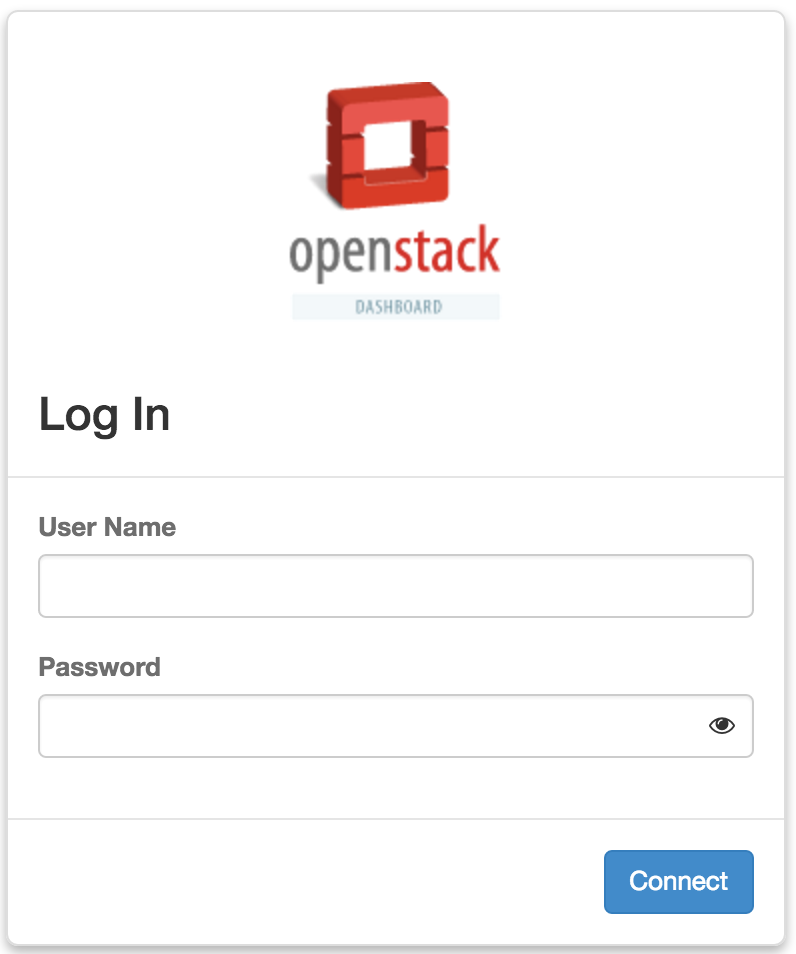
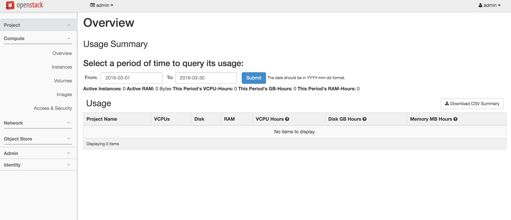

# RPM/RDO部署
RDO部署
安装环境
cat /etc/redhat-release
CentOS Linux release 7.2.1511 (Core)
IP: 115.182.107.175
CPU: 16核
内存：64GB


根据官方的说法，RDO指两件事，第一是指运行在Red Hat Enterprise Linux, CentOS, Fedora和他们的发行版上的可以免费使用并且有社区支持的OpenStack版本。它也是指一个社区，该社区的用户在Red Hat Linux操作系统上运行OpenStack，并且互相提供帮助和协作。
RDO是RPM Distribution of OpenStack的缩写。
下面通过RDO的快速安装文档，来部署OpenStack。

第一步: 前置需求
* 软件
x86_64 Red Hat Enterprise Linux (RHEL) 7 或CentOS 7及以上。
* 硬件
至少4GB内存, 处理器可虚拟化，至少有一个网卡。processors with hardware virtualization extensions
* 网络
网卡具有一个静态IP，禁用NetworkManager
* 系统配置
确保系统编码如下所示：
cat /etc/environment
LANG=en_US.utf-8
LC_ALL=en_US.utf-8

第二步: 软件包

设置RDO的软件源
$ sudo yum install -y https://rdoproject.org/repos/rdo-release.rpm
更新当前安装包
$ sudo yum update -y

第三步：安装Packstack Installer
$ sudo yum install -y openstack-packstack

第四步：运行Packstack安装OpenStack
Packstack将你从手动安装OpenStack的工作中解决出来，对于单节点的OpenStack部署，执行如下命令：
$ packstack --allinone

如果安装出现问题，请根据两位作者的联系方式寻求帮助。

安装成功后，会生成文件/root/keystonerc_admin。
通过[http://115.182.107.175/dashboard](http://115.182.107.175/dashboard)，和keystonerc_admin里的OS_USERNAME和OS_PASSWORD，可以登陆Horizon界面。
```unset OS_SERVICE_TOKEN
export OS_USERNAME=admin
export OS_PASSWORD=abc123xyz
export OS_AUTH_URL=http://115.182.107.175:5000/v2.0
export PS1='[\u@\h \W(keystone_admin)]\$ '

export OS_TENANT_NAME=admin
export OS_REGION_NAME=RegionOne```



登陆之后的界面如下图所示。


参考：
[https://www.rdoproject.org/](https://www.rdoproject.org/)
[https://www.rdoproject.org/install/quickstart/](https://www.rdoproject.org/install/quickstart/)
