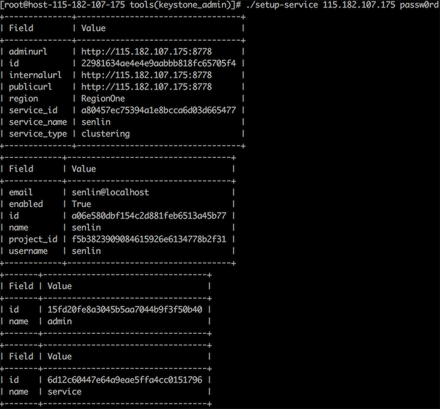

# Senlin
Senlin is a clustering service for OpenStack clouds. It creates and operates clusters of homogeneous objects exposed by other OpenStack services. The goal is to make the orchestration of collections of similar objects easier.

Senlin provides RESTful APIs to users so that they can associate various policies to a cluster. Sample policies include placement policy, load balancing policy, health policy, scaling policy, update policy and so on.

Senlin is designed to be capable of managing different types of objects. An object's lifecycle is managed using profile type implementations, which are themselves plugins.

##Senlin部署

* Install Senlin Server¶
1. Get Senlin source code from OpenStack git repository.
$ cd /opt/stack
$ git clone http://git.openstack.org/openstack/senlin.git
Install Senlin with required packages.
$ cd /opt/stack/senlin
$ sudo pip install -e .
Register Senlin clustering service with keystone.

This can be done using the setup-service script under the tools folder.

$ source ~/devstack/openrc admin
$ cd /opt/stack/senlin/tools
$ ./setup-service <HOST IP> <SERVICE_PASSWORD>

1. Generate configuration file for the Senlin service.
$ cd /opt/stack/senlin
$ tools/gen-config
$ sudo mkdir /etc/senlin
$ sudo cp etc/senlin/api-paste.ini /etc/senlin
$ sudo cp etc/senlin/policy.json /etc/senlin
$ sudo cp etc/senlin/senlin.conf.sample /etc/senlin/senlin.conf
Edit file /etc/senlin/senlin.conf according to your system settings. The most common options to be customized include:

1. 创建senlin数据库和用户senlin
::

 MariaDB [(none)]> create database senlin
 MariaDB [senlin]> grant all on senlin.* to 'senlin'@'%';
 MariaDB [senlin]> flush privileges;

[database]
connection = mysql://senlin:<MYSQL_SENLIN_PW>@127.0.0.1/senlin?charset=utf8

[keystone_authtoken]
auth_uri = http://<HOST>:5000/v3
auth_version = 3
cafile = /opt/stack/data/ca-bundle.pem
identity_uri = http://<HOST>:35357
admin_user = senlin
admin_password = <SENLIN PASSWORD>
admin_tenant_name = service

[authentication]
auth_url = http://<HOST>:5000/v3
service_username = senlin
service_password = <SENLIN PASSWORD>
service_project_name = service

[oslo_messaging_rabbit]
rabbit_userid = <RABBIT USER ID>
rabbit_hosts = <HOST>
rabbit_password = <RABBIT PASSWORD>
Create Senlin Database.
Create Senlin database using the senlin-db-recreate script under the tools subdirectory. Before calling the script, you need edit it to customize the password you will use for the senlin user. You need to update this script with the <DB PASSWORD> entered in step4.
$ cd /opt/stack/senlin/tools
$ ./senlin-db-recreate
Start senlin engine and api service.
You may need two consoles for the services i.e., one for each service.
$ senlin-engine --config-file /etc/senlin/senlin.conf
$ senlin-api --config-file /etc/senlin/senlin.conf
Install Senlin Client¶
Get Senlin client code from OpenStack git repository.
$ cd /opt/stack
$ git clone http://git.openstack.org/openstack/python-senlinclient.git
Install senlin client.
$ cd python-senlinclient
$ sudo python setup.py install
Verify Your Installation¶
To check whether Senlin server and Senlin client have been installed successfully, run command openstack cluster build info in a console. The installation is successful if the command output looks similar to the following.

$ openstack cluster build info
+----------+---------------------+
| Property | Value               |
+----------+---------------------+
| api      | {                   |
|          |   "revision": "1.0" |
|          | }                   |
| engine   | {                   |
|          |   "revision": "1.0" |
|          | }                   |
+----------+---------------------+
You are ready to begin your journey (aka. adventure) with Senlin, now.

参考：http://docs.openstack.org/developer/senlin/install.html
