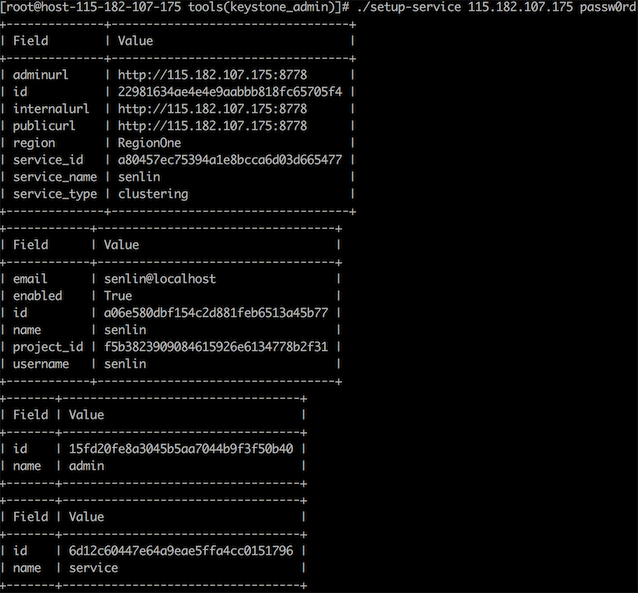

# Senlin
Senlin is a clustering service for OpenStack clouds. It creates and operates clusters of homogeneous objects exposed by other OpenStack services. The goal is to make the orchestration of collections of similar objects easier.

Senlin provides RESTful APIs to users so that they can associate various policies to a cluster. Sample policies include placement policy, load balancing policy, health policy, scaling policy, update policy and so on.

Senlin is designed to be capable of managing different types of objects. An object's lifecycle is managed using profile type implementations, which are themselves plugins.

##Senlin部署


安装Senlin Server
---------

1. 获取Senlin源代码
```
$ cd /opt/stack
$ git clone http://git.openstack.org/openstack/senlin.git
```
2. 安装Senlin的依赖包
```
cd /opt/stack/senlin
$ sudo pip install -e .
```
3. 将Senlin clustering service注册到keystone
```
  $ source ~/devstack/openrc admin
  $ cd /opt/stack/senlin/tools
  $ ./setup-service <HOST IP> <SERVICE_PASSWORD>
```
<SERVICE_PASSWORD>是senlin作为project service的user senlin的密码

4. 生成Senlin service需要的配置文件
```
  $ cd /opt/stack/senlin
  $ tools/gen-config
  $ sudo mkdir /etc/senlin
  $ sudo cp etc/senlin/api-paste.ini /etc/senlin
  $ sudo cp etc/senlin/policy.json /etc/senlin
  $ sudo cp etc/senlin/senlin.conf.sample /etc/senlin/senlin.conf
```
根据系统设置编辑/etc/senlin/senlin.conf，主要参考 /root/keystonerc_admin和 /etc/keystone/keystone.conf。
```
  [database]
  connection = mysql://senlin:<MYSQL_SENLIN_PW>@127.0.0.1/senlin?charset=utf8

  [keystone_authtoken]
  auth_uri = http://<HOST>:5000/v3
  auth_version = 3
  cafile = /opt/stack/data/ca-bundle.pem
  identity_uri = http://<HOST>:35357
  admin_user = senlin
  admin_password = <SENLIN PASSWORD>
  admin_tenant_name = service

  [authentication]
  auth_url = http://<HOST>:5000/v3
  service_username = senlin
  service_password = <SENLIN PASSWORD>
  service_project_name = service

  [oslo_messaging_rabbit]
  rabbit_userid = <RABBIT USER ID>
  rabbit_hosts = <HOST>
  rabbit_password = <RABBIT PASSWORD>
```  
为了配置上述conf文件，需要
* 创建数据库senlin的用户senlin
```
    create user 'senlin'@'%' identified by 'passw0rd';
    grant all on senlin.* to 'senlin'@'%';
    flush privileges;
```
 


5. 创建数据库Senlin
```
  $ cd /opt/stack/senlin/tools
  $ ./senlin-db-recreate
```
6. 启动senlinengine和api服务
需要两个终端，分别运行下面的服务启动命令
```
  $ senlin-engine --config-file /etc/senlin/senlin.conf
  $ senlin-api --config-file /etc/senlin/senlin.conf
```
安装Senlin Client
----------------

1. 获取Senlin Client源码
```
  $ cd /opt/stack
  $ git clone http://git.openstack.org/openstack/python-senlinclient.git
```
2. 安装senlin client
```
  $ cd python-senlinclient
  $ sudo python setup.py install
```
安装验证
------
```
  $ openstack cluster build info
  +----------+---------------------+
  | Property | Value               |
  +----------+---------------------+
  | api      | {                   |
  |          |   "revision": "1.0" |
  |          | }                   |
  | engine   | {                   |
  |          |   "revision": "1.0" |
  |          | }                   |
  +----------+---------------------+
```


参考：http://docs.openstack.org/developer/senlin/install.html
